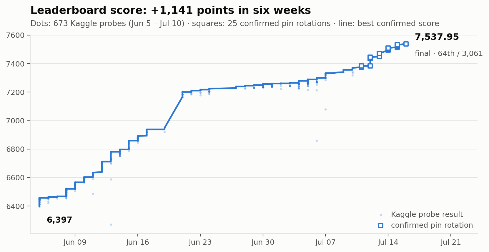
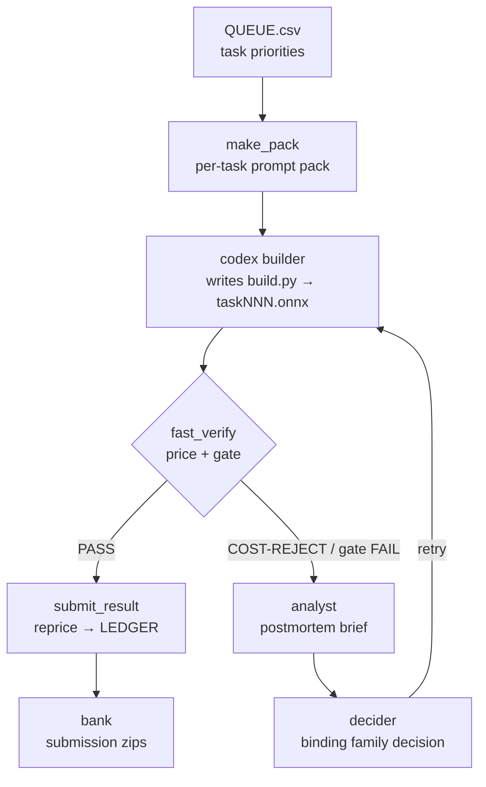
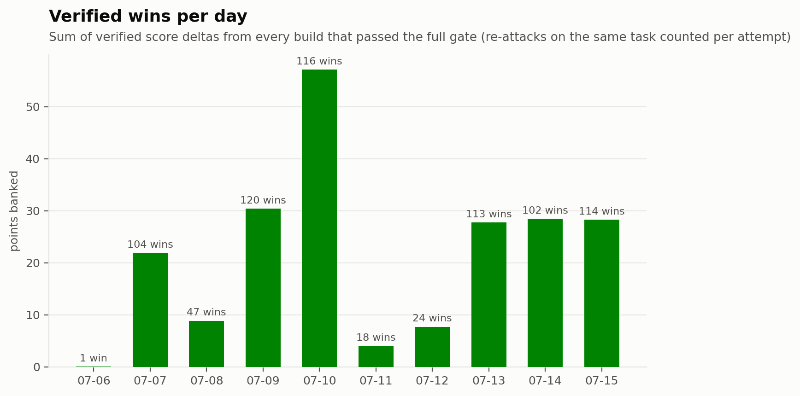
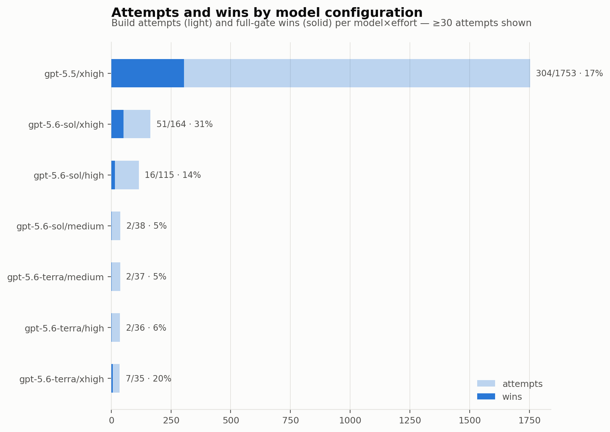
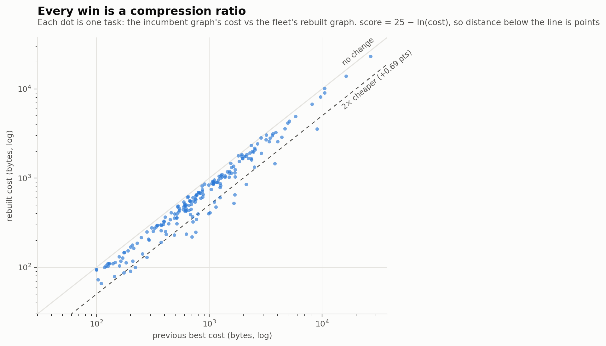
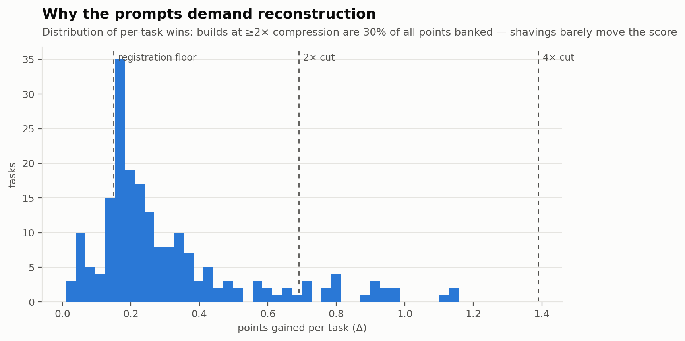

<div align="center">

# neurogolf

**An overnight LLM fleet that compiles ARC puzzles into the smallest possible neural networks.**

*It runs the whole loop unattended — accumulating its own evidence, acting on it to build and verify graphs, banking and submitting the wins to Kaggle, then ingesting each confirmed result as the baseline for the next wave.*

[](https://www.kaggle.com/competitions/neurogolf-2026/leaderboard)
[](#quickstart)
[](#quickstart)
[](LICENSE)

<br>

<picture>
  <source media="(prefers-color-scheme: dark)" srcset="docs/assets/plots/kaggle_score_dark.png">
  
</picture>

<br><br>

| 🥈 **[Silver medal](https://www.kaggle.com/competitions/neurogolf-2026/leaderboard)** · 64th / 3,061 | 📈 **+1,141** leaderboard pts | 🔨 **4,473** build attempts | ✅ **759** verified wins |
|:---:|:---:|:---:|:---:|

</div>

---

## The competition

This is the full solution that took a
[**🥈 silver medal — 64th of 3,061 teams**](https://www.kaggle.com/competitions/neurogolf-2026/leaderboard) (top 2.3%) in
[**The 2026 NeuroGolf Championship**](https://www.kaggle.com/competitions/neurogolf-2026/overview), organised by **Kaggle** & [**The Neurosynthetic
Research Institute**](https://neurosynthetic.org/).

The sport: every task in the [ARC benchmark](https://github.com/fchollet/ARC-AGI) hides a
transformation rule. Submit an ONNX graph that applies the rule perfectly — and get scored
on how *small* it is:

```
score = 25 − ln(params + memory_bytes)      # per task, on the Kaggle grader
```

One point costs one **e-fold** of compression: to gain +1.0, make the graph 2.72× cheaper.
The entire system — prompts, verifier, deciders, retry loops — is built around the
consequence of that law: **micro-optimizations are worthless; wins come from re-deriving
the rule and rebuilding the graph from scratch as a structurally cheaper design.**

## How it works

A *wave* is one overnight run. Every box below is an unattended LLM call or a
deterministic harness step; the only human actions are launching the wave and — by default,
though [this too can be automated](#quickstart) — submitting to Kaggle in the morning.



- **`make_pack`** compiles everything a builder needs into one `ATTACK.md`: the decoded
  rule verdict, the incumbent graph's per-tensor cost anatomy, a tailored strategy card,
  donor designs from similar tasks, worked exemplars, and the exact cost target.
- **Builders** (codex CLI, `gpt-5.5/xhigh`) write a `build.py` against `runner/ngolf.py`,
  a cost-aware ONNX builder library that tracks the exact grader cost of every tensor as
  the graph is composed — budget first, code second:

  ```python
  from ngolf import G
  g = G(task=364)
  m  = g.color_plane(3, cast="u8")     # one-hot channel 3 IS the mask of color 3
  d  = g.maxpool(m, 3)                 # dilate
  d  = g.mul(d, m)                     # geodesic constraint
  st = g.pad_to(d, 30, 30)             # back to the 30×30 canvas, uint8
  g.out_equal_arange(st, K=10)         # FREE terminal render → [1,10,30,30]
  print(g.budget())                    # exact params/memory/points, before saving
  g.save("task364.onnx")               # checker + shape-infer + ORT probe
  ```

- **`fast_verify`** is the only verdict: server-exact pricing plus a hard correctness gate
  (hundreds of fresh generator draws + a secret stream). No LLM ever judges correctness.
  Pricing isn't a re-implementation — it runs the competition's own Apache-2.0 scoring
  framework verbatim (vendored in `runner/grader/`), so the cost it reports *is* the Kaggle
  cost. Try it on any ONNX with zero setup: `python3 runner/price.py <model.onnx>`.
- Workers are isolated processes that never talk to each other directly; a trick learned on
  one task reaches the next through shared on-disk artifacts the orchestrator re-injects into
  every prompt — fleet lessons, won exemplars, donor recipes from similar solved tasks, and
  same-night sibling transfer tickets (stigmergy, not messaging).
- Every attempt is distilled by an **analyst** into an "attack differently" brief; a
  **decider** audits the full attempt record and issues a *binding* strategy decision for
  the retry. Failures cycle forever (endless mode) — nothing is abandoned, cooldowns just
  grow.
- A **watchdog** compares transcript tails mid-attempt and terminates stuck workers early,
  and a live **web console** (`runner/webui.py`, stdlib-only) shows every worker,
  decision, and banked point in real time.

## Results

Ten days of the fixed-scorer era: **4,473 build attempts and 759 gate-verified wins,
+214 points of verified per-attempt improvements** — while the leaderboard score climbed
**+1,141 points over six weeks**, from 6,397 to a final **7,537.95**.

<div align="center">
<picture>
  <source media="(prefers-color-scheme: dark)" srcset="docs/assets/plots/points_per_day_dark.png">
  
</picture>

<picture>
  <source media="(prefers-color-scheme: dark)" srcset="docs/assets/plots/model_stats_dark.png">
  
</picture>
</div>

Every win is a compression ratio — each dot below is one task, plotted as the incumbent
graph's cost against the fleet's rebuild. The distance below the diagonal *is* the score
gain:

<div align="center">
<picture>
  <source media="(prefers-color-scheme: dark)" srcset="docs/assets/plots/compression_dark.png">
  
</picture>

<picture>
  <source media="(prefers-color-scheme: dark)" srcset="docs/assets/plots/deltas_dark.png">
  
</picture>
</div>

Plots regenerate from the committed CSVs: `python3 runner/make_plots.py`
(`--derive` rebuilds the CSVs from raw run logs).

## It should scale with the compute you give it

Every attempt is an independent shot at one task, so throughput is roughly **seats ×
attempts per hour**, and attempts are the currency: over this campaign the best builder
configuration converted about **one attempt in six** into a gate-verified win. The seat
count is a live knob — `python3 runner/fleet.py set codex=24` is picked up within ~10s, and
shrinking drains rather than kills. Endless mode doesn't run short of work: 326 queued
tasks, and no task is abandoned.

**This silver medal was won on spare capacity.** The run used leftover Codex quota on a
single Pro plan — a 6→12 seat fleet, ramped to full size only after a one-hour canary. When
quota ran out the orchestrator benched the model for 30 minutes and re-queued the task with
*no attempt burned* and no history polluted. Nothing in the design pins it to that ceiling —
more seats, more hours, or a bigger plan should buy roughly proportionally more attempts, and
the queue, verifier, and decider loop don't care how many workers are running.

## The reconstruction doctrine

The single most important lesson of the project, distilled into every prompt
([RULES.md](data/RULES.md) §1b):

> `score = 25 − ln(cost)` ⇒ points buy cost **ratios**, never byte differences.
> −10% = +0.11 (worthless) · −50% = +0.69 · −90% = +2.30.
> All 74 historical Δ≥0.8 wins were STRUCTURAL replacements; **zero** came from shaving an
> existing design. **Reconstruction is the default posture: your first move on every task
> is to re-derive the rule and design a from-scratch graph, never to edit the pin.**

A worker's first act on any task is *Step Zero*: read the task's generator source and
state the rule in one sentence. If the strategy is rebuild-from-rule, the rule must pass a
numpy verifier (`hypo.py`) on 100% of visible examples **before any ONNX is written** — a
verified rule compiles in one pass; an unverified one wastes six.

See a complete real example in [`docs/examples/`](docs/examples): the full prompt pack for
task014, and the attempt record where 8 failures ended in a **+0.89** structural win
(a 2.4× cheaper graph) on attempt 9.

## Design principles

1. **One hard verifier, zero trusted LLMs.** Agents propose; the harness prices and gates.
   Agent-written numbers (LEDGER deltas, budget tables) are always recomputed.
2. **Budget first.** Every design is priced on paper before a line of code — "correct but
   expensive" was the #1 historical failure mode.
3. **Evidence over vibes.** Attempt records, postmortems, decisions, and prices all live
   on disk; every retry prompt embeds only verified evidence, and deciders are forced to
   audit their own past decisions against outcomes.
4. **Everything is resumable.** Claims, cooldowns, fleet sizing, and wave state live in
   files; the keepalive supervisor survives orchestrator death, and the operator can
   resize a live fleet with one command.

## Repository layout

| Path | What it is |
|------|------------|
| `data/RULES.md` | The law — injected into every worker prompt |
| `runner/orchestrate.py` | The brain: spawns workers/analysts/deciders, endless retry loop |
| `runner/make_pack.py` | Builds each task's self-contained prompt pack |
| `runner/ngolf.py` | Cost-aware ONNX builder library workers import |
| `runner/fast_verify.py` | The only verdict: server-exact price + correctness gate |
| `runner/grader/` | The vendored Kaggle scorer (Apache-2.0); `runner/price.py` drives it |
| `runner/submit_result.py` | Atomic completion: gate → reprice → LEDGER |
| `runner/bank.py` | Turns LEDGER wins into razor-scanned submission zips |
| `runner/preflight.py` | Fail-closed GO/NO-GO before any launch |
| `runner/webui.py` | Live operator console (stdlib, no dependencies) |
| `runner/config.py` | Every external path, env-overridable |
| `data/` | Seed knowledge: the law, task queue, strategy cards, worked exemplars |
| `docs/examples/` | A real prompt pack + attempt record |
| `runner/make_plots.py` | Regenerates the plots above |

## Quickstart

Runs from a clean clone, no external data:

```bash
pip install -r requirements.txt
python3 -m pytest -q                       # the test suite
python3 runner/price.py data/exemplars/task365.onnx   # score any ONNX with the real grader
python3 runner/orchestrate.py --dry-run --tasks 32   # print prompts + commands, spawn nothing
```

Everything else needs the operator's companions, and [docs/SETUP.md](docs/SETUP.md) is the
honest map of what runs where. In short: full correctness **gating** and real prompt
**packs** need the `neurogolf_clean` checkout (ARC-GEN generators + task grids) via
`NEUROGOLF_CLEAN`; the live overnight **wave** additionally needs the operator's `codex`
CLI; and **submission** needs Kaggle credentials plus an open competition — this one closed
on 2026-07-08, so the repo is a finished-campaign showcase, not a live entry.

**Banking is manual by default, automatic if you want it.** The launcher ships with
`KAGGLE_AUTOSUBMIT=0` and leaves the last step to you: `python3 runner/bank.py --dry-run`,
review, submit. Launch with `KAGGLE_AUTOSUBMIT=1` and `runner/auto_submit.py` closes the
loop unattended — bank → re-gate → submit → recon → repin → **reprioritize the queue →
continue** (the running orchestrator picks up the ingested pin and the new order live, no
restart) — behind its own rails: flock single-flight, integrity SHA check, pin
triple-consistency, a razor scan of the live pin, and a daily-quota guard with a hard
reserve.

## License

MIT — see [LICENSE](LICENSE).

<div align="center">
<sub>Built for <a href="https://www.kaggle.com/competitions/neurogolf-2026/overview">The 2026 NeuroGolf Championship</a> — Kaggle × <a href="https://neurosynthetic.org/">The Neurosynthetic Research Institute</a></sub>
</div>
