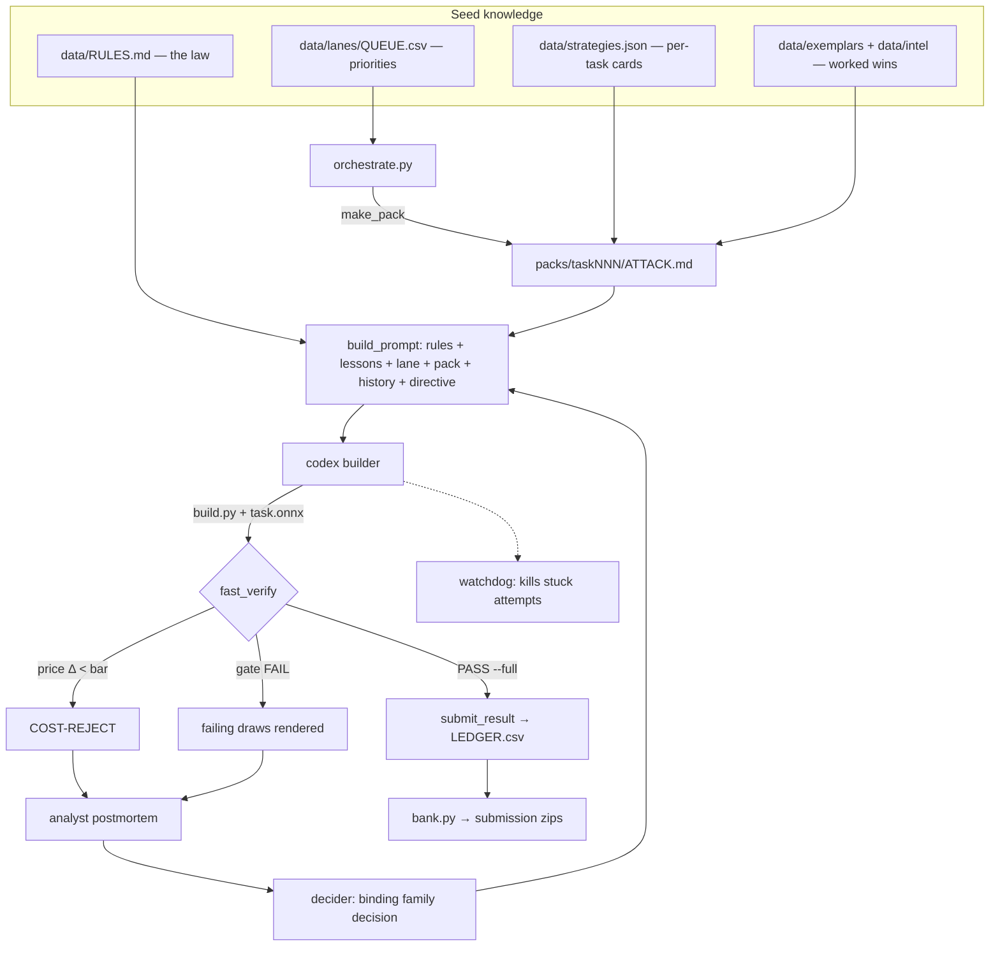

# Architecture

One overnight *wave* = one `orchestrate.py` session driving a fleet of unattended LLM
calls against a hard, deterministic verifier. This document walks the full loop.

## The cost model

`score = max(1, 25 − ln(params + memory))` per task on the Kaggle grader, where *params*
counts initializer **elements** (dtype-blind — pack your constants) and *memory* charges
every node-output tensor once at `elements × dtype_bytes` under strict static shape
inference. The graph input (`[1,10,30,30]` one-hot fp32) and the final node's output are
free — hence *terminal renderers*: end the graph with one op that expands tiny state into
the full output.

The consequence: **points buy ratios.** A 10% shave is +0.11 (below the +0.15 registration
floor); halving the graph is +0.69; and the paying moves are structural — a different
representation of the same rule, not a cheaper spelling of the old one. `RULES.md` §1b
encodes this as the *reconstruction doctrine* and every prompt leads with it.

## Roles (all through the codex CLI)

| Role | Config | What it does |
|------|--------|--------------|
| **Builder** | `gpt-5.5/xhigh` | Writes `build.py` with `ngolf.py`, iterates against `fast_verify` |
| **Decider** | 50% `gpt-5.5/xhigh` · 50% `gpt-5.6-sol/xhigh` (Sol takes the hardest) | Audits the complete attempt record, issues a binding continue/pivot decision with a costed budget |
| **Analyst** | `gpt-5.3-codex-spark` (read-only, tool-disabled) | Distills every attempt into a ≤11-bullet brief that gates the retry |
| **Watchdog** | `gpt-5.3-codex-spark` | Classifies mid-attempt transcript tails; two non-progressing strikes ⇒ early termination |
| **Reader** (`ask_reader.py`) | `gpt-5.3-codex-spark` | Worker-callable extraction from huge files — keeps builder context clean |

Provider/model routing lives at the top of `orchestrate.py` (`MODELS`,
`GPT_CAPABILITY_ROUTES`, `DECIDER_*`); seats are resized live via `runner/fleet.py` and
`results/FLEET.json`.

## Trust boundaries

- **No LLM judges correctness.** `fast_verify.py` prices with the grader-exact
  `scoring_v2` replica and gates with real generator draws plus a secret stream
  (`gate_pair`). Exit codes are the only verdict.
- **No LLM touches the scorer.** The INTEGRITY LOCK (RULES.md) rejects any plan that
  reads or edits pricing code; `integrity.py` SHA-checks the authorities; `preflight.py`
  fails closed.
- **Agent-written numbers are recomputed.** `bank.py` reprices every LEDGER row before
  zipping; `price_search.py` recomputes every model-proposed budget arithmetically.
- **Weak evidence is quarantined.** Infra deaths are filtered at read time; optional
  weak-screen models (env `WEAK_MODELS`) never advance rotations or floor verdicts.

## The self-improvement loop

Attempt N's prompt embeds everything attempts 1…N−1 learned: outcome-labeled history,
analyst briefs, the decider's binding decision (with a harness-priced design table), and
fleet-wide `LESSONS.md`. Wins propagate: every DONE copies its `build.py` into
`data/exemplars/` and advertises the family in LESSONS, so wins spread to similar tasks the
same night. Deciders get the *complete chronological record* and must audit each of their
own past decisions against its result before deciding again.

## Endless mode

Every non-win outcome — fail, NO, timeout, small win below `--improve-below` — cycles back
through analyst → decider → retry, forever, with per-task cooldowns growing in attempts.
Banked wins re-enter with the HOUSE-MONEY framing: the floor is locked, so only a
structurally different family ≥2× cheaper than the banked member is worth building.

## Files on disk (per task, under `results/taskNNN/`)

`ATTEMPTS.jsonl` (outcome records) · `attempts/attNN_*.log` + `_prompt.txt` (full
transcripts) · `POSTMORTEM_attNN.md` (analyst) · `DECISION_attNN.md` + `_input.md`
(decider + its evidence) · `PRICES_attNN.md` (harness-priced designs) · `NOTES.md` /
`NO.md` (worker artifacts). Global: `results/LEDGER.csv`, `LESSONS.md`,
`RUN_STATE.json`, `STATUS.txt`, `ORCHESTRATOR.log`.
